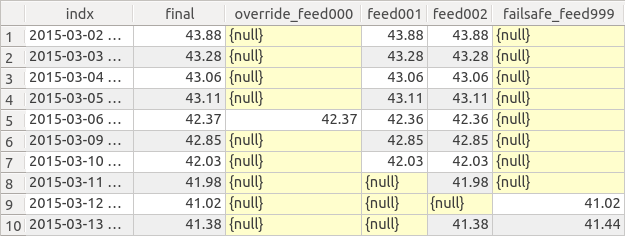

Data Flow
=========
Trump centralizes the flow of information using two concepts:

1. Objectification - the process of persistently storing information about data.
2. Caching - the process of fetching data, saving it systematically, and serving it intelligently.

Objectification
---------------

The objectification happens via an addition-like process entailing the instantiation of one or more symbols.  
The objectification enables downstream applications to work with symbol names in order to force the caching, and be served reliable data.

There are two approaches to perform the objectification instantiation of Symbols

1. First Principles (from ORM)
2. Template Based (from Special Python Classes + ORM)
 
First Principles
^^^^^^^^^^^^^^^^

The first principles approach to using Trump is basically direct access to the SQLAlchemy-based object-relational model.
It's time consuming to develop with, but necessary to understand in order to design new intelligent templates.

Using Trump's ORM, the process is something akin to:

For Every Symbol:

	1. Instantiate a new :py:class:`~trump.orm.Symbol`
	2. Optionally, add some :py:class:`~trump.orm.SymbolTag`
	3. Optionally, adjust the symbol's :py:class:`~trump.orm.Index` case and type
	4. Optionally, adjust the symbol's :py:class:`~trump.orm.SymbolHandle` handlepoints
	5. Instantiate one ore more :py:class:`~trump.orm.Feed` objects
	6. For each Feed, update :py:class:`~trump.orm.FeedMeta`, :py:class:`~trump.orm.FeedSource` details
	7. Optionally, adjust each feed's :py:class:`~trump.orm.FeedMunge` instructions
	8. Optionally, adjust each feed's :py:class:`~trump.orm.FeedHandle` handlepoints
	9. Optionally, adjust each Symbol's :py:class:`~trump.orm.SymbolValidity` instructions

Template Based
^^^^^^^^^^^^^^

By setting up, and using Trump template classes, the two steps below replace steps 1 to 8 of the first principles approach. 

For Every Kind of Symbol:

	1. Create custom templates for common sources of proprietary data.

For Every Symbol:

	2. Instantiate a new :py:class:`~trump.orm.Symbol` using a template containing Tag, Feed, Source, Handle, Validity settings.
	3. Tweak any details uncovered by the chosen templates for the symbol, or any of it's feeds.

In practice, it's inevitable that templates will be used where possible, and do the heavy lifting of instantiation, but tweaks to each symbol would be made post-instantiation.	

Caching
-------

The cache process, is more than just caching, but that's the main purpose.  The cache process,
essentially builds a fresh datatable.  In order to cache a symbol, Trump performs the following
steps:

   For each Feed...
   
   1. Fetches a fresh copy of each Feed, based on the :py:class:`~trump.orm.FeedSource` parameters.
   2. Munges each Feed, based on the :py:class:`~trump.orm.FeedMunge` parameters.
   3. Converts the datatype using a :py:class:`~trump.orm.SymbolDataDef`
   
   Then...
   
   4. Concatenates the data from each feed, into a dataframe.
   5. Converts the index datatype using the Symbol's :py:class:`~trump.orm.Index` parameters.
   6. Two columns are appended to the dataframe, one for overrides, one for failsafes.  Any which exist, are fetched.
   7. An aggregation method is used to build a final series out of the data from the feeds and any overrides/failsafes.
   8. The dataframe is stored in the database, in it's own table, called a datatable.  
   9. Optionally, any validity checks, which are set up in :py:class:`~trump.orm.SymbolValidity`, are performed.

When executed, data from each Feed is queried, and munged according to predefined instructions,
on a per-feed basis.  The feeds are joined together, each forming columns of a pandas Dataframe. 
A :py:class:`~trump.indexing.IndexImplementor` corrects the index.  An aggregation method converts the Dataframe into a single, final, Series.
Depending on the aggregation method, any single values are overrode, and blanks get populated, based on any previously
defined :py:class:`~trump.orm.Override` and :py:class:`~trump.orm.FailSafe` objects associated with the symbol being cached.

The Datatable & Aggregation
^^^^^^^^^^^^^^^^^^^^^^^^^^^

Steps #6, #7 & #8 above are easiest to understand, with a graphical look at the final product: a cached Symbol's datatable.

An example of a datatable, is in the figure below.  This, is a simple table, common to anybody with SQL knowledge.

   Example of a symbol's datatable, with two feeds of data, both with problems.

The example datatable, seen above, is one symbol with two feeds, both of which had problems.  One of the 
feeds stopped completely on the 11th, the other had a missing datapoint.  Plus, a previous problem,
looks like it was manually overrode on the 6th, but then later, the feed started working again.  
The overrides and failsafes were applied appropriately on the 6th, and the 12th, while the 
failsafe on the 10th, was ignored after the feed #2 started working again.

It's easy to imagine the simple Dataframe after step #5 of the cache process.  It would have a single
index, then a column for every Feed.  #6, appends the two columns mentioned, along with any individual datapoints. 
Then an aggregation method creates the 'final' column.  Details about the specific aggregation method are defined at, or updated after, 
Symbol instantiation.  Up to and including the aggregation, all operations are simply changing the dataframe of feeds, overrides, and failsafes.

After the final is calculated, the dataframe is stored until the next cache, as a table - the datatable, illustrated in the figure above.  
It can then be quickly checked for validity and served to applications.