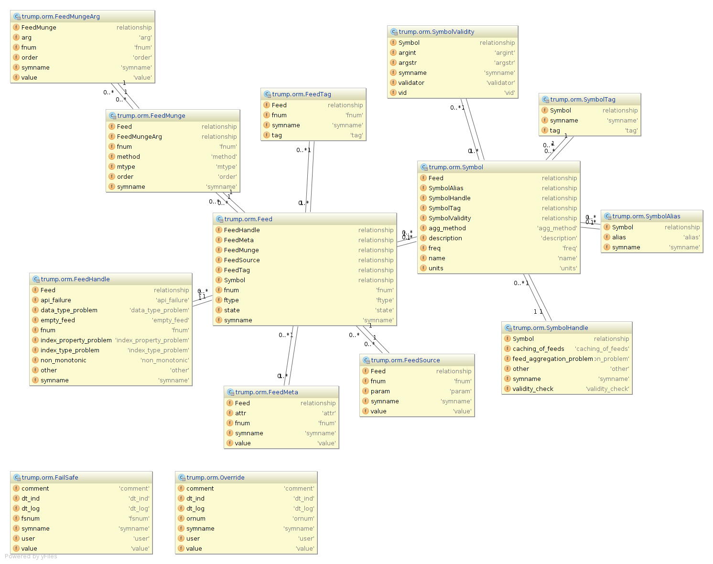

Object Model
============

Symbol Manager
------------------------

.. autoclass:: trump.orm.SymbolManager
   :members: create, delete, get, complete, finish

Symbols
------------
   
.. autoclass:: trump.orm.Symbol
   :members: cache, describe

.. autoclass:: trump.orm.SymbolTag

.. autoclass:: trump.orm.SymbolHandle

.. autoclass:: trump.orm.Index
   :members: setkwargs, getkwargs

.. autoclass:: trump.orm.IndexKwarg
   :members: setval, val

Feeds
--------

.. autoclass:: trump.orm.Feed
   :members: cache

.. autoclass:: trump.orm.FeedMeta

.. autoclass:: trump.orm.FeedMunge

.. autoclass:: trump.orm.FeedMungeArg

.. autoclass:: trump.orm.FeedHandle

.. automodule :: trump.indexing

Centralized Data Editing
----------------------------------

Each trump datatable comes with two extra columns beyond the feeds, index and final.  

The two columns are populated by any existing overrides and failsafes, which survive
caching, and modification to feeds.  

The Override will get applied blindly regardless of feeds, and the failsafes are used
only when data isn't availabe.  Once it becomes available for a specific index in the datatable,
the failsafe is ignored.

.. autoclass:: trump.orm.Override

.. autoclass:: trump.orm.FailSafe
