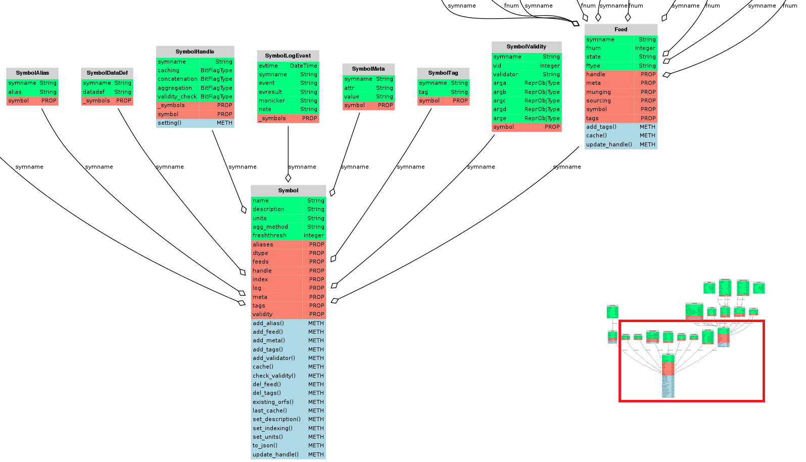
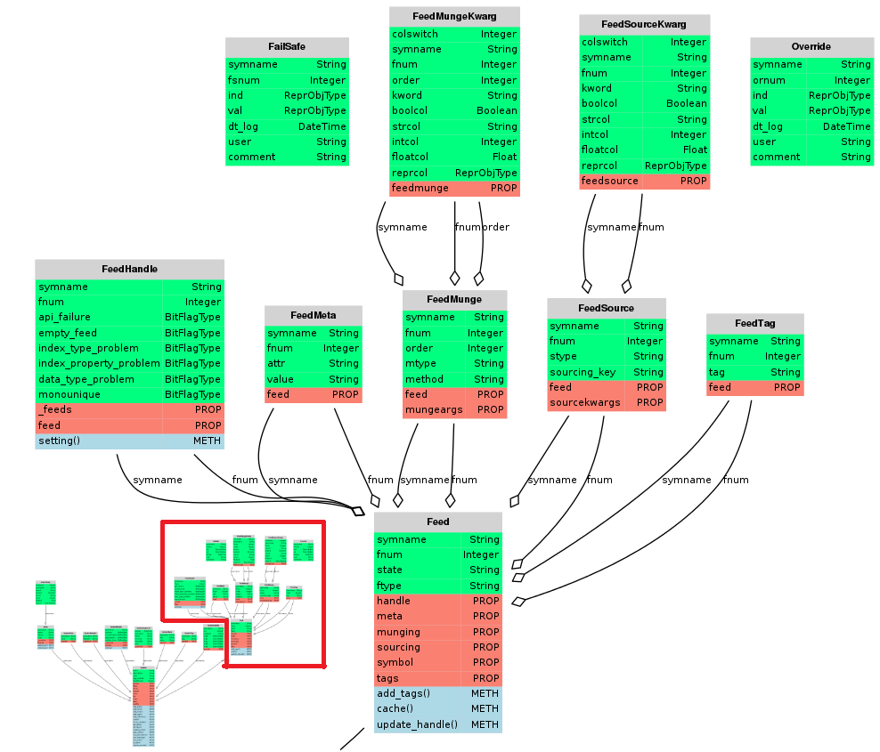

Object-relational Model
=======================

Trump's persistent object model, made possible by it's object-relational model (ORM), all starts with
a :py:class:`~trump.orm.Symbol`, and an associated list of :py:class:`~trump.orm.Feed` objects. 

An fragmented illustration of the ORM is presented in the three figures below. 

Supporting objects store details persistently about error handling, sourcing, munging, and validation, so that a :py:class:`~trump.orm.Symbol` can :py:meth:`~trump.orm.Symbol.cache`
the data provided from the various :py:class:`~trump.orm.Feed` objects,
in a single datatable or serve up a fresh pandas.Series at anytime. A symbol's it's :py:class:`~trump.orm.Index`, can further enhance the intelligence that Trump can serve via pandas.
   

   The symbol portion of the ORM, excludes the symbol's datatable.

   The feed portion of the ORM.

.. figure:: orfs-orm.png

   The override and fail safe portion of the ORM, are unlinked to any other object, by design.

.. note::

   Trump's template system consists of objects, which are external to the ORM.
   Templates are used to expedite construction of ORM objects.  Nothing about any template,
   persists in the database.  Only instatiated ORM objects would do so.  Templates, 
   should be thought of as boilerplate, or macros, to reduce Feed creation time.
   
Symbol Manager
--------------

.. autoclass:: trump.orm.SymbolManager
   :members: create, delete, get, complete, finish, search, search_tag, build_view_from_tag, add_override, add_fail_safe

Conversion Manager
------------------

.. autoclass:: trump.orm.ConversionManager
   :members: get_converted

Symbols
-------

.. autoclass:: trump.orm.Symbol
   :members: cache, describe, update_handle, add_feed, add_tags, add_validator, set_indexing, check_validity, isvalid

.. autoclass:: trump.orm.SymbolTag

.. autoclass:: trump.orm.SymbolDataDef

Indices
~~~~~~~

A :py:class:`~trump.orm.Symbol` object's :py:class:`~trump.orm.Index` stores the information
required for Trump to cache and serve data with different types of pandas indices.  

.. warning::

   A Trump :py:class:`~trump.orm.Index` does not contain a list of hashable values, like a pandas
   index.  It should not be confused with the datatable's index, however it is used in the creation
   of the datatable's index.  A more appropriate name for the class might be IndexCreationKwargs.

.. autoclass:: trump.orm.Index
   :members:

.. autoclass:: trump.orm.IndexKwarg
   :members:

Index Types
^^^^^^^^^^^

.. automodule:: trump.indexing
   :members: IndexImplementer, DatetimeIndexImp, PeriodIndexImp, StrIndexImp, IntIndexImp

Validity Checking
~~~~~~~~~~~~~~~~~~~

.. autoclass:: trump.orm.SymbolValidity
   :members:

Feeds
-----

.. autoclass:: trump.orm.Feed

.. autoclass:: trump.orm.FeedMeta

.. autoclass:: trump.orm.FeedSource

.. autoclass:: trump.orm.FeedSourceKwarg

Feed Munging
~~~~~~~~~~~~

.. autoclass:: trump.orm.FeedMunge

.. autoclass:: trump.orm.FeedMungeKwarg

Centralized Data Editing
------------------------

Each trump datatable comes with two extra columns beyond the feeds, index and final.  

The two columns are populated by any existing :py:class:`~trump.orm.Override` and :py:class:`~trump.orm.FailSafe` objects which survive
caching, and modification to feeds.  

Any :py:class:`~trump.orm.Override` will get applied blindly regardless of feeds, while the :py:class:`~trump.orm.FailSafe` objects are used
only when data isn't availabe for a specific point.  Once a datapoint becomes available for a specific
index in the datatable, the failsafe is ignored.

.. autoclass:: trump.orm.Override
   :members:

.. autoclass:: trump.orm.FailSafe
   :members:

Error Handling
--------------

The Symbol & Feed objects have a single SymbolHandle and FeedHandle object accessed
via their .handle attribute. They both work identically. The only difference is the
column names that each have.  Each column, aside from symname,
represents a checkpoint during caching, which could cause errors external to trump.
The integer stored in each column is a serialized BitFlag object, which uses bit-wise
logic to save the settings associated with what to do upon an exception.  What to do,
mainly means deciding between various printing, logging, warning or raising options.

The Symbol's possible exception-inducing handle-points include:

- caching (of feeds)
- concatenation (of feeds)
- aggregation (of final value column)
- validity_check

.. autoclass:: trump.orm.SymbolHandle
   :members:

The Feed's possible exception-inducing handle-points include:

- api_failure
- empty_feed
- index_type_problem
- index_property_problem
- data_type_problem
- monounique

.. autoclass:: trump.orm.FeedHandle
   :members:

For example, if a feed source is prone to problems, set the api_failure to print the trace by setting the BitFlag object's 'stdout' flag to True, and the other flags to False.
If there's a problem, Trump will attempt to continue, and hope that there is another feed with good data available.  However, if a source should be reliably available,
you may want to set the BitFlag object's 'raise' flag to True.

BitFlags
~~~~~~~~

Trump stores instructions regarding how to handle exceptions in specific points of the cache
process using a serializable object representing a list of boolean values calleda BitFlag.
There are two objects which make the BitFlag implementation work.  There is the BitFlag object, which
converts dictionaries and integers to bitwise logic, and then there is the BitFlagType which give
SQLAlchemy the ability to create columns, and handle them appropriately, containing BitFlag objects.

.. autoclass:: trump.tools.bitflags.BitFlag
  :members: bin, bin_str, asdict, __and__, __or__

.. autoclass:: trump.tools.bitflags.BitFlagType
