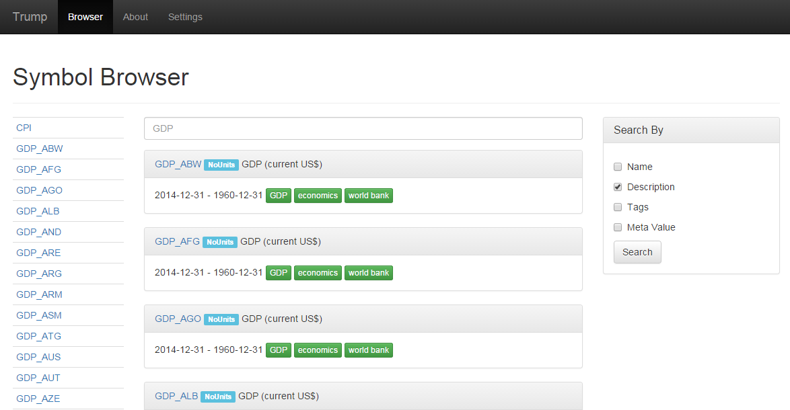
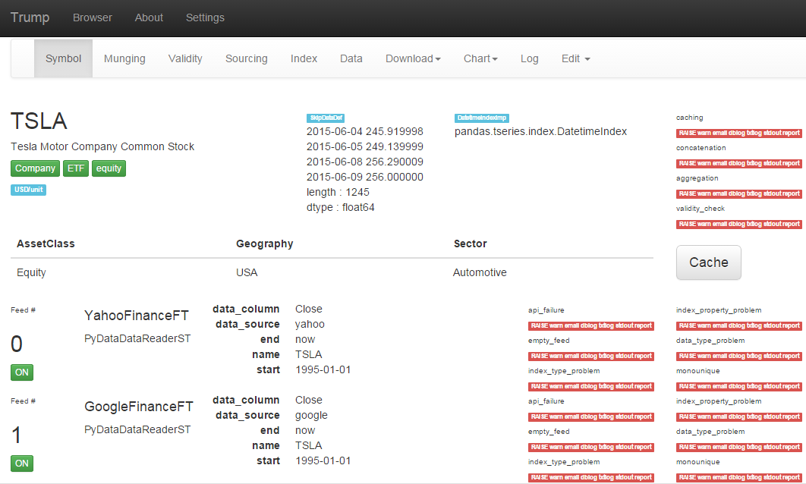
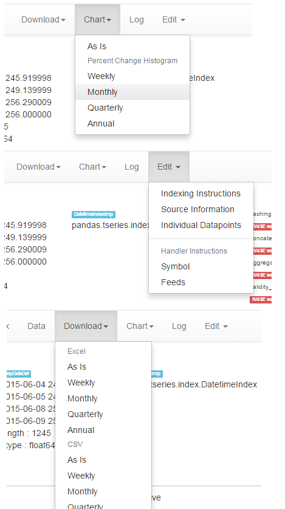

UI Prototype
============

A preliminary user interface for Trump is being prototyped.

Web Interface
-------------

The web UI was born out of Flask, Jinja2 and Bootstrap "hello world".

Some screen shots, of the beginning, are below.
   

   (For now) all symbols available are listed alphabetically to the left.
   Symbols can be searched by name, tags, meta, and description.  

   An example of symbol page, for a symbol with two feeds.  

   Some of the menus, are starting to take shape.  One can generate a plot, or download data to excel.

Search
------

Trump's SymbolManager object, has basic/expected SQL-enabled search functionality.

The Trump UI prototype is boosted by an ElasticSearch server with a single index consisting
of symbol, tag, description, and meta data.  To add a symbol to the index, use the 
json created from Symbol.to_json().

Background Caching
------------------

Trump's caching process isn't blazing fast, which means using the UI to kick off caching of 
one or more symbols, requires a background process in order for the web interface to
stay responsive.

A very simple RabbitMQ consumer application, is included with the UI, which listens 
for the instruction to cache.  The python pika package is required.
