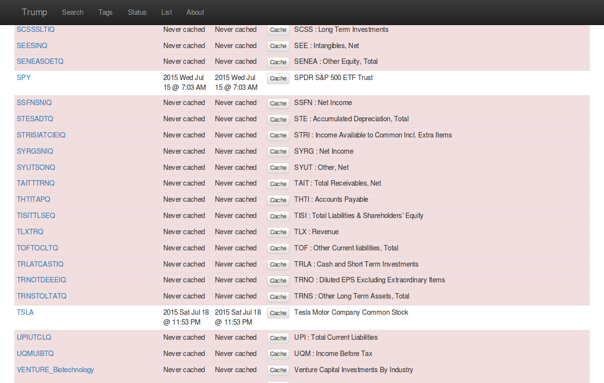

UI Prototype
============

A preliminary user interface for Trump is being prototyped.

Web Interface
-------------

The web UI was born out of Flask, Jinja2 and Bootstrap "hello world".

Some screen shots, of the beginning, are below.
   

   SQL-like search, is straight forward and as expected. 

   An example of symbol page, for a symbol with two feeds.  

   View the index, data, and do common analysis.
   Or, download to excel/csv...

   Histograms and basic charting are available.

   Overrides and failsafes, are what makes Trump amazing for business processes.

   The last time a symbol was attempted, and successfully cached, are available.
   

   Browse and cache sets of symbols, based on tags...

And, much, much more, coming soon...

   
Search
------

Trump's SymbolManager object, has basic/expected SQL-enabled search functionality.

The Trump UI prototype is boosted by an ElasticSearch server with a single index consisting
of symbol, tag, description, and meta data.  To add a symbol to the index, use the 
json created from Symbol.to_json().

.. figure:: ui-search-fuzzy.png

   ElasticSearch, makes searching much cooler...
   

Background Caching
------------------

Trump's caching process isn't blazing fast, which means using the UI to kick off caching of 
one or more symbols, requires a background process in order for the web interface to
stay responsive.

A very simple RabbitMQ consumer application, is included with the UI, which listens 
for the instruction to cache.  The python pika package is required.
